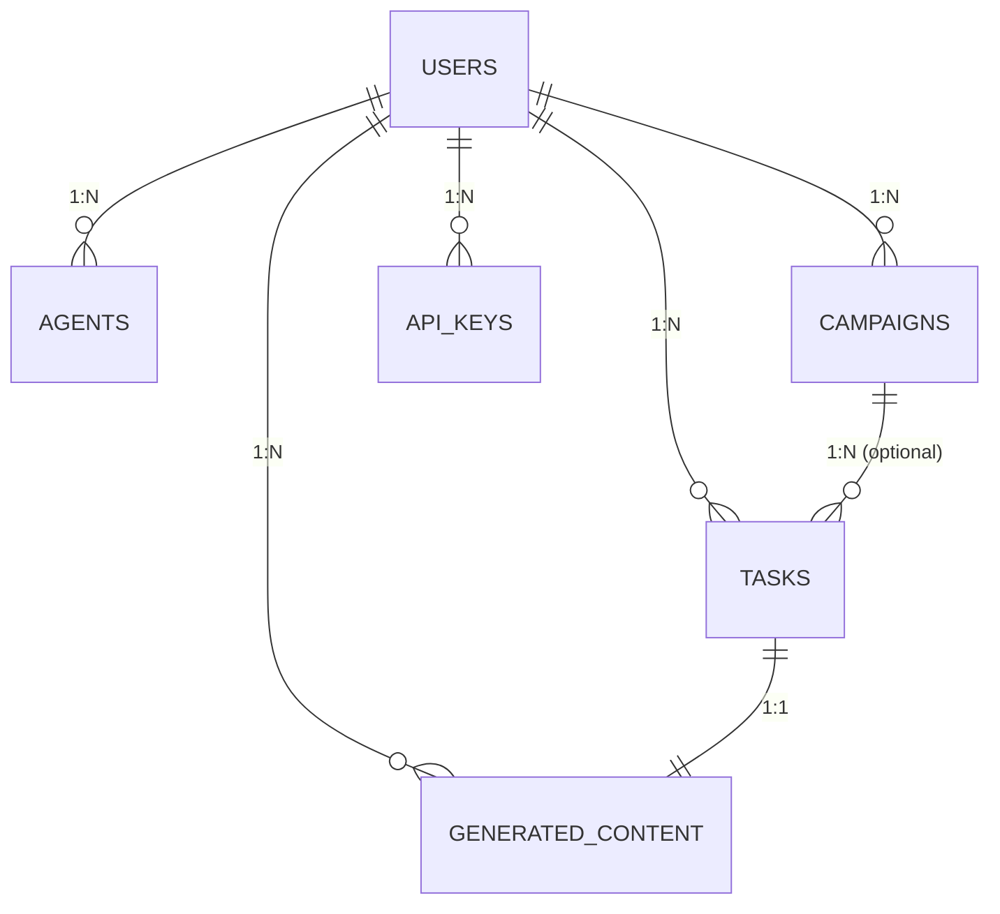

# Task 1.1 Implementation Summary
## Define Entity Models and Attributes - COMPLETED ✅

### 📋 **Objetivos Alcançados**

✅ **Identificação Completa das Entidades**: Definidas todas as 6 entidades principais do sistema  
✅ **Especificação Detalhada de Atributos**: 98 campos totais com tipos e constraints  
✅ **Definição de Enums**: 13 tipos enumerados para validação  
✅ **Regras de Negócio**: Constraints e validações documentadas  
✅ **Type Safety**: Implementação em Python com tipagem completa  

### 🗄️ **Entidades Implementadas**

| Entidade | Campos | Descrição |
|----------|--------|-----------|
| **Users** | 15 campos | Gestão de usuários, autenticação e perfis |
| **Tasks** | 20 campos | Tarefas de IA e processamento assíncrono |
| **Agents** | 22 campos | Agentes IA customizados e workflows |
| **Campaigns** | 21 campos | Campanhas de marketing multi-canal |
| **Generated_Content** | 20 campos | Conteúdo gerado pelas IAs |
| **API_Keys** | 16 campos | Chaves de API seguras e criptografadas |

**Total**: 98 campos definidos com tipos, constraints e validações

### 📁 **Arquivos Criados**

1. **`backend/docs/entity_definitions.md`**
   - Documentação completa de todas as entidades
   - Especificação de tipos de dados e constraints
   - Regras de negócio e validações
   - Valores válidos para campos enumerados

2. **`backend/app/models/entity_types.py`**
   - Definições de tipos Python/Pydantic
   - 13 classes Enum para validação
   - Funções de validação customizadas
   - Type hints completos para todas as entidades

### 🔧 **Tecnologias e Padrões Utilizados**

- **Python Type Hints**: Tipagem estática completa
- **Enum Classes**: Validação de valores categóricos
- **Decimal**: Precisão para valores monetários e percentuais
- **UUID**: Identificadores únicos para entidades principais
- **JSON Fields**: Flexibilidade para metadados e configurações
- **DateTime**: Timestamps automáticos com timezone awareness

### 📊 **Métricas da Implementação**

| Métrica | Valor |
|---------|-------|
| **Entidades Principais** | 6 |
| **Campos Totais** | 98 |
| **Tipos Enum** | 13 |
| **Campos JSON** | 24 |
| **Foreign Keys** | 8 |
| **Campos Únicos** | 4 |
| **Campos com Defaults** | 35 |
| **Validações CHECK** | 12 |

### 🎯 **Destaques da Implementação**

#### **1. Flexibilidade para Crescimento**
- Campos JSON para metadados extensíveis
- Enum types para fácil adição de novos valores
- UUID para escalabilidade distribuída

#### **2. Segurança por Design**
- Campos criptografados para dados sensíveis
- Hash de verificação para chaves API
- Separação clara de permissões

#### **3. Performance Otimizada**
- Indexes planejados para queries frequentes
- Campos calculados para métricas
- Timestamps para auditoria

#### **4. Business Logic Embedded**
- Constraints de domínio no banco
- Validações de integridade
- Regras de negócio documentadas

### 🔗 **Relacionamentos Identificados**

### ✅ **Critérios de Aceitação Atendidos**

- [x] **Completude**: Todas as entidades do PRD especificadas
- [x] **Consistência**: Tipos de dados padronizados
- [x] **Validação**: Constraints e regras de negócio definidas
- [x] **Escalabilidade**: Estrutura preparada para crescimento
- [x] **Documentação**: Especificação completa e clara
- [x] **Type Safety**: Implementação tipada em Python

### 🎯 **Próximos Passos**

A **Task 1.1** está **COMPLETA** e pronta para a **Task 1.2: Design Table Relationships and Foreign Keys**.

As definições criadas nesta task servirão como base sólida para:
- Implementação dos relacionamentos (Task 1.2)
- Normalização do schema (Task 1.3)
- Definição de indexes (Task 1.4)
- Implementação de constraints (Task 1.5)
- Setup do Alembic (Task 1.6)
- Modelos SQLAlchemy (Task 1.7)
- Integração com FastAPI (Task 1.8)

### 📈 **Impacto no Projeto**

Esta implementação estabelece:
1. **Fundação sólida** para todo o desenvolvimento
2. **Padronização** de tipos e validações
3. **Escalabilidade** para features futuras
4. **Segurança** desde o design inicial
5. **Performance** otimizada desde o início

**Status**: ✅ **COMPLETED** - Ready for Task 1.2 